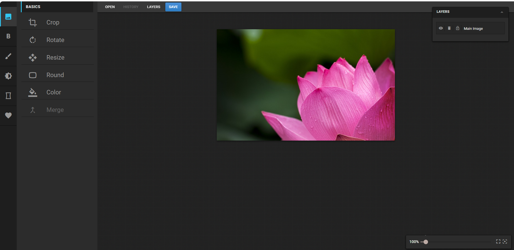
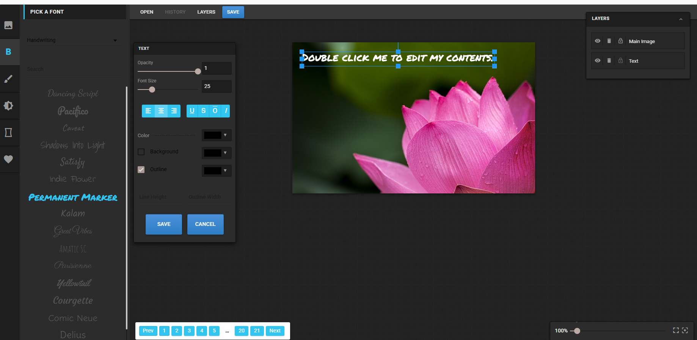
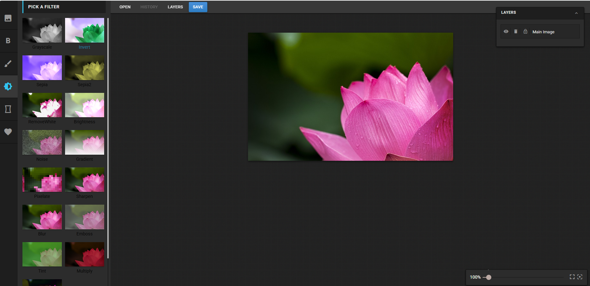
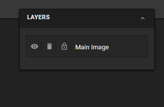

# 🎨 Pixie Image Editor - Photoshop Style

A modern, feature-rich web-based image editor with a professional Photoshop-inspired dark theme interface. Built with AngularJS, Fabric.js, and powered by advanced image manipulation capabilities.


## ✨ Features

### 🖼️ Core Image Editing
- **Crop & Resize** - Flexible cropping with aspect ratio control and custom dimensions
- **Rotate & Transform** - 90° quick rotate or custom angle rotation
- **Rounded Corners** - Add rounded corners with adjustable radius
- **Canvas Background** - Change canvas background color

### 🎨 Advanced Tools
- **Text Editor** - Add and customize text with multiple fonts, sizes, and styles
- **Drawing Tools** - Multiple brush types (pencil, spray, circle, diamond, etc.)
- **Shape Library** - Rectangle, circle, ellipse, triangle, and polygon shapes
- **Filters** - 15+ professional filters (blur, sharpen, brightness, contrast, sepia, grayscale, etc.)
- **Stickers** - Rich collection of stickers (animals, beach, clouds, doodles, landmarks, etc.)

### 🎯 Professional Features
- **Layers Panel** - Manage, reorder, hide/show, and lock layers
- **History Panel** - Undo/redo with complete edit history
- **Zoom Controls** - Precise zoom controls with fit-to-screen option
- **Multiple Export Formats** - Save as JPEG, PNG, or JSON (editor state)

### 🌙 Photoshop-Inspired Interface
- **Dark Theme** - Professional dark interface for reduced eye strain
- **Blue Accents** - Photoshop-style blue highlights and active states
- **Fixed Top Toolbar** - Quick access to main functions
- **Icon-Only Navigation** - Clean 60px sidebar with icon-only navigation
- **Smooth Transitions** - Polished animations and interactions
- **Shadow Depth** - Professional depth and elevation effects

## 🚀 Quick Start

### Prerequisites

- Node.js (>= 14.0.0)
- npm or yarn

### Installation

```bash
# Clone the repository
git clone https://github.com/yourusername/pixie-image-editor.git
cd pixie-image-editor

# Install dependencies
cd frontend
npm install
```

### Development

```bash
# Compile LESS to CSS
npm run build

# Or use gulp watch for auto-compilation
npx gulp watch

# Or compile manually
npx lessc assets/less/main.less assets/css/main.css
```

### Run the Application

```bash
# Option 1: Open directly in browser
# Simply open frontend/index.html in your browser

# Option 2: Use a local server (recommended)
npx http-server -p 8080
# Then visit http://localhost:8080
```

## 📁 Project Structure

```
myeditor/
├── frontend/
│   ├── assets/
│   │   ├── css/              # Compiled CSS files
│   │   │   ├── main.css      # Main stylesheet (Photoshop theme)
│   │   │   └── integrate.css
│   │   ├── js/               # JavaScript files
│   │   │   ├── editor/       # Editor modules
│   │   │   │   ├── App.js
│   │   │   │   ├── Canvas.js
│   │   │   │   ├── basics/   # Crop, Rotate, Resize, etc.
│   │   │   │   ├── text/     # Text tools
│   │   │   │   ├── drawing/  # Drawing tools
│   │   │   │   ├── filters/  # Image filters
│   │   │   │   ├── shapes/   # Shapes and stickers
│   │   │   │   └── objects/  # Layer management
│   │   │   └── vendor/       # Third-party libraries
│   │   ├── less/             # LESS source files
│   │   │   ├── main.less     # Main styles (Photoshop theme)
│   │   │   └── vendor/       # Bootstrap, Material Design
│   │   ├── images/           # Image assets
│   │   │   ├── brushes/
│   │   │   ├── filters/
│   │   │   ├── shapes/
│   │   │   ├── stickers/
│   │   │   └── textures/
│   │   └── fonts/            # Material Design Icons
│   ├── index.html            # Main application
│   ├── gulpfile.js           # Gulp build tasks
│   ├── package.json          # Dependencies
│   └── config.json           # App configuration
└── README.md                 # This file
```

## 🎨 Customization

### Changing Theme Colors

Edit `frontend/assets/less/main.less`:

```less
// Photoshop-inspired Dark Theme
@primary-color: #1E1E1E;          // Almost black (panel headers)
@secondary-bg: #2C2C2C;           // Dark gray (panel body)
@tertiary-bg: #383838;            // Medium dark (tabs, top bar)
@accent-color: #31C5F0;           // Photoshop blue (active states)
@hover-color: #474747;            // Hover states
```

Then recompile:

```bash
cd frontend
npx lessc assets/less/main.less assets/css/main.css
```

### Adding Custom Filters

Add your filter in `frontend/assets/js/editor/filters/Filters.js`:

```javascript
this.all.push({
    name: 'YourFilter',
    displayName: 'Your Filter',
    apply: function(canvas) {
        // Your filter logic here
    }
});
```

### Adding Custom Stickers

1. Place images in `frontend/assets/images/stickers/your-category/`
2. Update `frontend/assets/js/editor/shapes/StickersCategories.js`

## 🛠️ Technologies Used

### Frontend
- **AngularJS 1.x** - Application framework
- **Fabric.js** - Canvas manipulation
- **Angular Material** - UI components
- **jQuery** - DOM manipulation
- **Spectrum.js** - Color picker
- **LESS** - CSS preprocessing

### Build Tools
- **Gulp** - Task automation
- **LESS Compiler** - CSS compilation
- **Autoprefixer** - CSS vendor prefixes
- **Uglify** - JavaScript minification

## 📋 Browser Support

- ✅ Chrome (recommended)
- ✅ Firefox
- ✅ Safari
- ✅ Edge
- ⚠️ IE11 (limited support)

## 🤝 Contributing

Contributions are welcome! Please feel free to submit a Pull Request.

1. Fork the project
2. Create your feature branch (`git checkout -b feature/AmazingFeature`)
3. Commit your changes (`git commit -m 'Add some AmazingFeature'`)
4. Push to the branch (`git push origin feature/AmazingFeature`)
5. Open a Pull Request

## 📝 Known Issues

- Gulp compatibility with Node.js v22+ (use direct LESS compilation)
- Some filters may be slow on large images
- Mobile responsiveness needs improvement

## 🔮 Future Enhancements

- [ ] Layer blending modes
- [ ] Advanced selection tools (magic wand, lasso)
- [ ] Gradient tool
- [ ] Clone stamp tool
- [ ] Image adjustments (curves, levels)
- [ ] Batch processing
- [ ] Cloud storage integration
- [ ] Mobile responsive design
- [ ] PWA support
- [ ] Collaborative editing

## 📄 License

This project is licensed under the MIT License - see the [LICENSE](LICENSE) file for details.

## 👤 Author

**Le Thi Nha My**
- Email: my.le2412138@hcmut.edu.vn
- University: Ho Chi Minh City University of Technology (HCMUT)

## 🙏 Acknowledgments

- Inspired by Adobe Photoshop's interface design
- Built upon the Pixie Image Editor base
- Icons by Material Design Icons
- Fabric.js for canvas manipulation
- AngularJS community for excellent documentation

## 📸 Screenshots

### Main Interface


### Text Editor


### Filters


### Layers Panel


---

**Made with ❤️ by Le Thi Nha My**

*For educational purposes at HCMUT*
